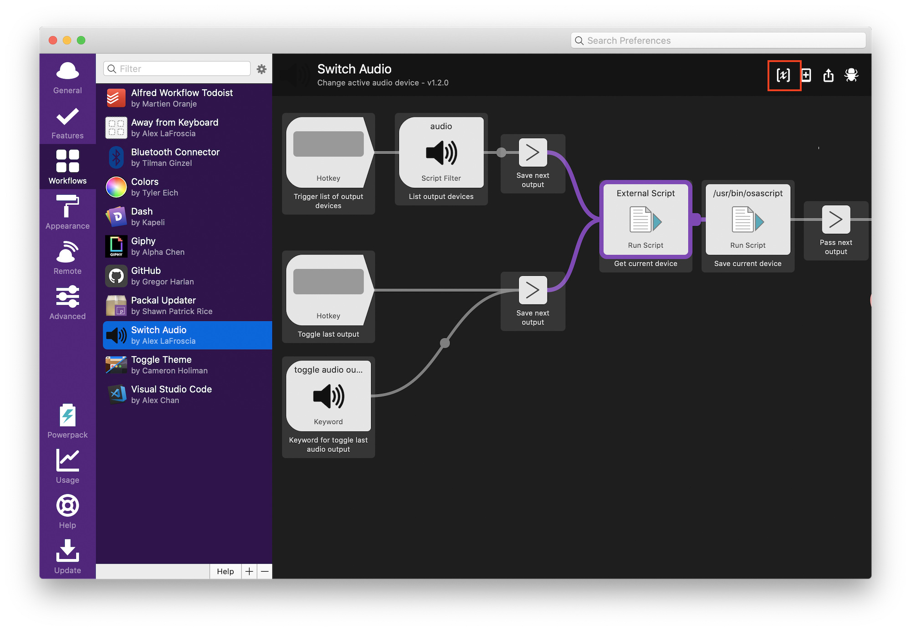
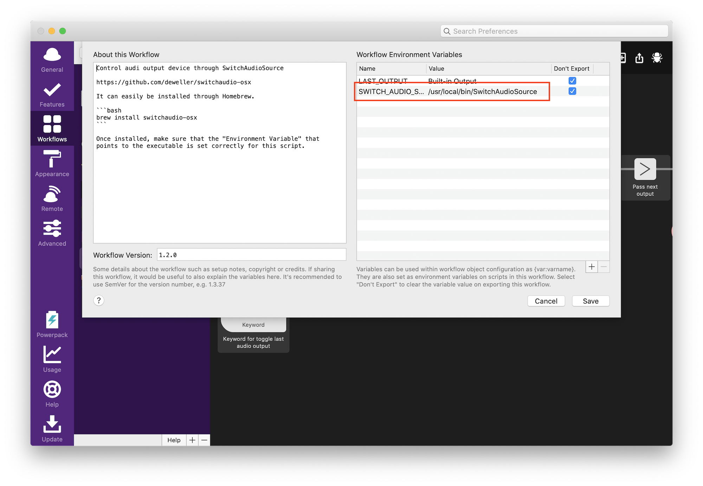

# Alfred Switch Audio

An [Alfred][alfred] front-end for [`switchaudio-osx`][switchaudio-osx]

## Installation

1.  Download the [latest version of the workflow][download-link]
2.  Install [`switchaudio-osx`][switchaudio-osx], probably through [Homebrew][homebrew]

    ```bash
    brew install switchaudio-osx
    ```

3.  Take note of where the program was installed

    ```bash
    which SwitchAudioSource
    ```

4.  Configure the environment variable in the Alfred plugin to point to that path

    a. Open your Alfred preferences and select this plugin

       

    b. Open the Configuration panel highlighted in the image below
    c. Change the _Workflow Environment Variable_ to match the value found in the previous step

       

## Usage

This plugin provides an `audio out` and `audio in` command that will list the available devices. Select one of them to make that the active audio output device.


The additional command `toggle audio output` will toggle between your last audio output and your current one.
Both commands have the ability to add a hotkey for quick access.

[alfred]: https://www.alfredapp.com
[switchaudio-osx]: https://github.com/deweller/switchaudio-osx
[download-link]: https://github.com/alexlafroscia/alfred-switch-audio-source/releases/latest/download/Switch-Audio-1.2.0.alfredworkflow
[homebrew]: http://brew.sh
