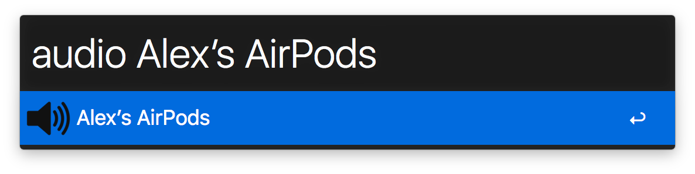

# Alfred Switch Audio

An [Alfred][alfred] front-end for [`switchaudio-osx`][switchaudio-osx]

## Installation

1. Download the [latest version of the workflow][download-link]
2. Install [`switchaudio-osx`][switchaudio-osx], probably through [Homebrew][homebrew]

    ```bash
    brew install switchaudio-osx
    ```

3. Take note of where the program was installed

    ```bash
    which SwitchAudioSource
    ```

4. Configure the environment variable in the Alfred plugin to point to that path

## Usage

This plugin provides an `audio` command that will list the available devices. Select one of them to make that the active audio output device.



[alfred]: https://www.alfredapp.com
[switchaudio-osx]: https://github.com/deweller/switchaudio-osx
[download-link]: https://github.com/alexlafroscia/alfred-switch-audio-source/releases/download/latest/Switch.Audio.alfredworkflow
[homebrew]: http://brew.sh
